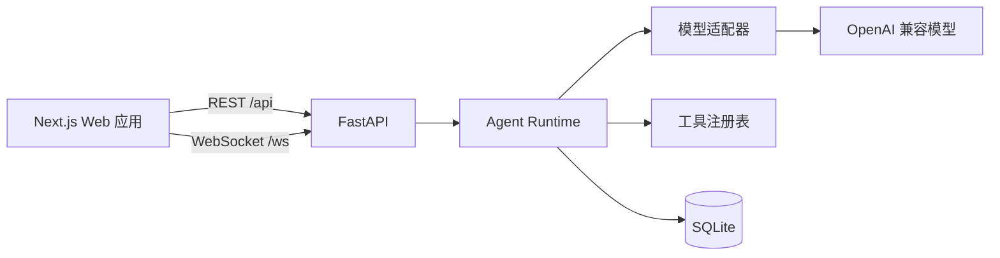

<p align="center">
  
</p>

<p align="center">
  一个以流式 Agent Loop 为核心的 Web AI 学习平台。
</p>

<p align="center">
  
  
  
  
  
  
</p>

TeachX 是一个受 [DeepTutor](https://github.com/HKUDS/DeepTutor) 启发的独立
Web 项目。它保留了 AI 学习产品真正有价值的核心：流式 Agent Loop、模型工具调用、
可复用教学模式、持久化对话，以及完整的 Next.js Web 界面。

项目目标不是封装一次模型 API，而是构建一个能理解、能部署、能继续扩展的真实产品。

## 开发交接

如果你要新开对话、更换开发者或恢复上下文，请先阅读：

- [TeachX 开发交接文档](docs/HANDOFF.md)
- [完整开发路线](docs/roadmap.md)
- [TeachX 文档写作指南](docs/documentation-guide.md)
- [2026 AI 岗位技术栈调研](docs/research/2026-AI岗位技术栈调研.md)
- [面向 Agent 的项目规则](AGENTS.md)

## 当前状态

P0、P1、P2 已完成，P3 的认证、用户隔离和个人资料基础也已完成。普通用户学习闭环
和用户级模型连接已可用；管理员功能、Docker 和 PostgreSQL 暂缓。

| 模块 | 状态 |
| --- | --- |
| Next.js Web 应用 | 可用，47 个路由均可成功构建 |
| FastAPI 后端 | 可用 |
| WebSocket 回合协议 | 可用 |
| SQLite 会话持久化 | 可用 |
| Agent Loop | 可用 |
| 计算器工具调用 | 可用 |
| 工具执行可靠性 | 支持工具政策、临时错误有限重试、超时、幂等去重和可观测元数据 |
| Mock 模型 | 可用 |
| OpenAI 兼容模型适配器 | 已使用 DeepSeek Flash 验证流式输出、工具调用和真实聊天 |
| 知识库 | 支持 TXT、Markdown、PDF 上传，FTS5、向量和 RRF 混合检索 |
| 登录认证 | bcrypt、JWT HttpOnly Cookie、WebSocket 鉴权、会话按用户隔离 |
| 资源授权 | 知识库按 owner_id 隔离，管理员可查看全部资源 |
| 个人档案 | 头像标记、图片头像、学习目标与讲解偏好 |
| 首次使用引导 | 新用户设置学习阶段、目标、讲解偏好和可选资料，可跳过；旧用户不会被迫重新引导 |
| 个性化回答 | 学习档案注入系统提示词，聊天页显示状态并支持快速开关 |
| 学习反馈与错题记录 | 回答可标记有帮助或不清楚，可记录理解误区、筛选、回看原对话、继续追问并删除 |
| 练习与复习 | 从知识库片段生成开放题，自评后安排复习，并按知识库展示掌握度 |
| 对话中的学习目标 | 聊天页显示目标、进度和完成状态，修改目标自动重新激活并进入后续回答提示词 |
| 模型连接 | 可选择平台默认，或保存并激活 DeepSeek、OpenAI、自定义 OpenAI 兼容平台 |
| Agent 费用控制 | 记录真实或估算 token，限制输出、历史和工具上下文，支持每日预算与超限阻止/回退 |
| 容器部署 | 暂缓，不作为当前开发阻塞；配置文件保留备用 |
| 持续集成 | 后端检查与前端生产构建 |

P1 的核心开发已经完成：`complete` 与 `stream` 双接口、真实 token 流式输出、
工具参数分片拼接、能力模式提示词、会话标题生成和更完整的工具事件都已加入。

P2 已经完成：知识库创建、文档上传、文本提取、段落切块、SQLite FTS5、Embedding
向量索引、RRF 混合排序、`knowledge_search` 工具和 `sources` 引用事件都能端到端运行。
P3 认证与资源隔离已经完成，普通用户的核心学习闭环也已覆盖引导、个性化、反馈、
练习复习、学习目标和用户级模型连接。Agent 费用控制、Provider 错误映射和上下文
预算也已完成。工具执行的有限重试、超时和幂等保护已经加入；下一阶段继续评测、
多工具执行和真实 Embedding。
管理员功能、PostgreSQL 和 Docker 继续暂缓，不作为当前开发阻塞。

## 为什么使用 TeachX

- **Agent 原生：** 模型回合可以调用工具、读取结果并继续推理，直到形成最终答案。
- **Web 优先：** 产品围绕浏览器交互设计，而不是把 Web 界面当作附加功能。
- **模型无关：** 运行时只依赖一个小型 Provider 接口，可以在托管模型和本地
  OpenAI 兼容模型之间切换，而不需要重写 Agent Loop。
- **可持续：** 会话、消息和回合事件都会持久化，并支持后续回放。
- **方便扩展：** 工具与能力模式都有清晰接口，不需要把逻辑硬编码进聊天路由。

## 系统架构



第一阶段刻意把核心链路控制得足够小：

```text
Next.js UI
  -> 统一回合协议
  -> AgentRuntime
  -> Provider Adapter
  -> Tool Registry
  -> Session Repository
```

## 快速开始

### 环境要求

- Python 3.12+
- Node.js 22+
- npm 10+
- [uv](https://docs.astral.sh/uv/)

默认使用 Mock 模型，不需要 API Key。

### 本地开发

### 1. 启动后端

```bash
cd backend
uv sync
uv run uvicorn teachx.main:app --app-dir src --reload --port 8010
```

### 2. 启动前端

打开第二个终端：

```bash
cd frontend
cp .env.example .env.local
npm ci
npm run dev
```

浏览器访问 [http://localhost:3000](http://localhost:3000)。

可以直接发送下面这条消息，验证完整链路：

```text
计算 12 * 8
```

这条消息会依次经过浏览器、Next.js 代理、FastAPI WebSocket 协议、Agent Runtime、
计算器工具和 SQLite 持久化。

## 接入真实模型

TeachX 目前支持 OpenAI 及兼容 Chat Completions 的接口。

```bash
export TEACHX_LLM_PROVIDER=openai
export TEACHX_MODEL=gpt-4.1-mini
export OPENAI_API_KEY=your-api-key
export OPENAI_BASE_URL=https://api.openai.com/v1
```

修改模型配置后需要重启后端。启用真实向量检索时，还需要设置：

```bash
export TEACHX_EMBEDDING_PROVIDER=openai
export TEACHX_EMBEDDING_MODEL=text-embedding-3-small
```

费用控制默认启用保守的上下文和输出上限。需要设置用户每日预算时：

```bash
export TEACHX_MAX_OUTPUT_TOKENS=1024
export TEACHX_MAX_HISTORY_MESSAGES=24
export TEACHX_MAX_TOOL_RESULT_CHARS=6000
export TEACHX_DAILY_TOKEN_BUDGET=100000
export TEACHX_BUDGET_EXCEEDED_ACTION=block
```

`0` 表示关闭日预算；超限行为可选择 `block` 或 `mock`。模型标题生成默认关闭，
需要额外标题调用时设置 `TEACHX_GENERATE_TITLES=true`。

工具执行默认使用有限重试和超时：

```bash
export TEACHX_TOOL_MAX_ATTEMPTS=3
export TEACHX_TOOL_TIMEOUT_SECONDS=30
export TEACHX_TOOL_RETRY_BASE_DELAY_MS=200
export TEACHX_TOOL_RETRY_MAX_DELAY_MS=2000
```

每个工具可以覆盖这些默认值。参数错误不会重试，临时错误和超时才会进入有限退避重试。

工具执行同时带有幂等保护：同一回合内重复提交的相同工具调用只会执行一次，后来的
重复请求直接返回第一次的结果，并可通过 `TEACHX_TOOL_IDEMPOTENCY_ENABLED=false` 关闭：

```bash
export TEACHX_TOOL_IDEMPOTENCY_ENABLED=true
export TEACHX_TOOL_EXECUTION_STALE_SECONDS=300
```

## 启用登录认证

默认情况下，本地开发关闭认证。需要使用用户系统时设置：

```bash
export TEACHX_AUTH_ENABLED=true
export TEACHX_AUTH_SECRET=replace-with-at-least-32-random-bytes
export TEACHX_AUTH_COOKIE_SECURE=false
```

前端 `.env.local` 同时设置：

```bash
NEXT_PUBLIC_AUTH_ENABLED=true
```

第一个注册用户会获得管理员角色。正式 HTTPS 部署时，必须将
`TEACHX_AUTH_COOKIE_SECURE=true`。

## 当前可用功能

- 基于 WebSocket 的流式回合事件
- Mock 和 OpenAI 兼容模型的流式内容增量
- 支持历史记录的聊天会话
- 基础多轮上下文
- 计算器工具调用，并记录调用 ID、状态和耗时
- 工具声明只读属性、最大尝试次数和超时，由 `ToolRegistry` 统一执行有限退避重试
- 工具失败区分临时错误、永久错误和超时，并记录尝试次数、重试次数和耗时
- 工具调用幂等保护：重复请求重放已保存结果，有副作用工具不会因重试被重复执行
- `chat`、`deep_solve`、`deep_question` 的专属提示词
- 自动生成会话标题，并提供本地兜底标题
- 知识库创建、文件和 PDF 上传
- 文档提取、段落切块和 SQLite FTS5 全文检索
- Mock / OpenAI 兼容 Embedding 向量检索
- FTS5 与向量结果的 RRF 混合排序
- 已有文本块的向量重建索引
- `knowledge_search` 工具与来源引用事件
- 用户注册、登录和退出登录
- bcrypt 密码哈希与 JWT HttpOnly Cookie
- HTTP 与 WebSocket 认证边界
- 会话按用户隔离
- 知识库所有权隔离与管理员全局访问
- Agent 检索工具继承当前用户权限
- 普通用户个人主页
- 图标与图片头像管理
- 年龄、年级、学习目标、课程体系、语言、阅读水平和讲解风格
- 根据学习档案自动调整回答深度、语言、阅读难度和讲解风格
- 用户可关闭个性化，档案内容按数据处理并限制长度
- 聊天输入框上方显示当前年级、讲解风格和个性化开关
- 新用户首次使用引导，支持学习阶段、学习目标、讲解偏好和可选资料上传，也可跳过
- 导师回答支持“有帮助”“不清楚”和“记录我的误区”
- 学习记录页支持筛选、回看原问题与回答、删除记录和把误区带回聊天继续追问
- 从用户知识库生成开放式练习，保存作答并按自评安排复习
- 练习页支持到期队列、掌握度、下次复习时间和知识库维度的进度
- 聊天页显示当前学习目标、进度和完成状态，支持一键完成或转到个人主页调整
- 已完成目标不再注入回答提示词，修改目标文字会自动重新激活
- 模型连接页支持 DeepSeek、OpenAI 和自定义 OpenAI 兼容平台
- 支持测试连接、读取模型列表、选择默认模型和切换平台默认模型
- 用户 API Key 使用服务端密钥加密存储，接口不回传明文或密文
- 每次模型调用记录 prompt、completion、total token、估算标记和调用耗时
- 助手回答下方展示本轮与当前会话累计 token，并显示每日预算状态
- 输出 token、历史消息、历史字符和工具结果都有可配置上限
- 超预算可阻止真实调用或回退 Mock，并在事件中明确标记
- 超时、429、5xx、连接失败和流中断转换为稳定错误事件
- 后端和前端生产 Dockerfile
- GitHub Actions 后端检查和前端生产构建
- Docker 配置文件保留备用，当前暂停验证
- 原 DeepTutor 可选界面的兼容接口

## 项目结构

```text
TeachX/
├── AGENTS.md                后续 Agent 必读规则
├── backend/                 FastAPI 服务和 Agent Runtime
│   ├── src/teachx/
│   │   ├── api/             HTTP 与 WebSocket 适配层
│   │   ├── auth/            用户、密码和 JWT 服务
│   │   ├── providers/       Mock 与 OpenAI 兼容模型适配器
│   │   ├── knowledge/       文档提取、切块、索引和检索
│   │   ├── runtime/         Agent Loop 和工具系统
│   │   └── storage/         SQLite 持久化
│   └── tests/
├── frontend/                基于 Apache-2.0 复用的 Next.js 界面
├── compose.yaml             前后端一体化容器编排
├── docs/
│   ├── architecture.md
│   ├── documentation-guide.md 面向新手的中文文档规范
│   ├── readme-guide.md      README 编写与维护规范
│   └── roadmap.md
├── scripts/
│   ├── dev.sh               同时启动前后端
│   └── check.sh             执行项目检查
└── third_party/
    └── DeepTutor-LICENSE
```

## 质量检查

```bash
./scripts/check.sh
```

当前检查内容包括：

- Ruff 静态检查
- 后端自动测试
- 前端 TypeScript 类型检查

前端生产构建需要单独验证：

```bash
cd frontend
npm run build
```

## 技术教程

面向基础薄弱读者的中文教程从这里开始：

- [教程目录](docs/tutorials/README.md)
- [00：如何阅读这个项目](docs/tutorials/00-如何阅读这个项目.md)
- [01：一次提问的完整旅程](docs/tutorials/01-一次提问的完整旅程.md)
- [02：从 `complete` 到 `stream`](docs/tutorials/02-从complete到stream.md)
- [03：工具调用是怎么工作的](docs/tutorials/03-工具调用是怎么工作的.md)
- [04：知识库与 RAG](docs/tutorials/04-知识库与RAG.md)
- [05：向量检索与混合排序](docs/tutorials/05-向量检索与混合排序.md)
- [06：认证与权限](docs/tutorials/06-认证与权限.md)
- [07：多用户数据隔离](docs/tutorials/07-多用户数据隔离.md)
- [08：Docker 部署](docs/tutorials/08-Docker部署.md)
- [09：CI 持续集成](docs/tutorials/09-CI持续集成.md)
- [10：个人资料与学习档案](docs/tutorials/10-个人资料与学习档案.md)
- [11：个性化提示词](docs/tutorials/11-个性化提示词.md)
- [12：聊天页个性化状态](docs/tutorials/12-聊天页个性化状态.md)
- [13：首次使用引导](docs/tutorials/13-首次使用引导.md)
- [14：学习反馈与错题记录](docs/tutorials/14-学习反馈与错题记录.md)
- [15：练习与复习模式](docs/tutorials/15-练习与复习模式.md)
- [16：对话中的学习目标](docs/tutorials/16-对话中的学习目标.md)
- [17：用户模型连接与多平台](docs/tutorials/17-用户模型连接与多平台.md)
- [18：Agent 费用控制与 Provider 稳定性](docs/tutorials/18-Agent费用控制与Provider稳定性.md)
- [19：工具执行政策、重试与幂等保护](docs/tutorials/19-工具执行政策与重试.md)

## 开发路线

| 阶段 | 范围 | 状态 |
| --- | --- | --- |
| P0 | 可运行的 Web 与后端垂直切片 | 已完成 |
| P1 | 真实流式模型、工具轨迹、能力提示词 | 已完成；DeepSeek Flash 流式和工具调用已验证 |
| P2 | 知识库上传、检索与引用 | 已完成 |
| P3 | 登录认证、数据隔离、管理与部署 | 进行中，认证和资源隔离已完成；Docker 暂缓 |
| P4 | CI、截图、在线演示与简历文档 | 计划中 |

真实供应商已使用 DeepSeek Flash 完成聊天和工具调用验证；真实 Embedding 联调仍待配置
支持 Embeddings 的平台。

完整开发路线、已完成里程碑、每次迭代内容和验收标准见
[docs/roadmap.md](docs/roadmap.md)。

## 与 DeepTutor 的关系

TeachX 不是 DeepTutor 的官方仓库。前端按照 Apache-2.0 许可证复用，后端和运行时
则围绕更小的产品边界重新实现。

来源与归属说明见 [UPSTREAM.md](UPSTREAM.md)。

## 许可证

本项目使用 Apache License 2.0，详见 [LICENSE](LICENSE)。上游完整的
Apache-2.0 文本同时保留在
[third_party/DeepTutor-LICENSE](third_party/DeepTutor-LICENSE)。
