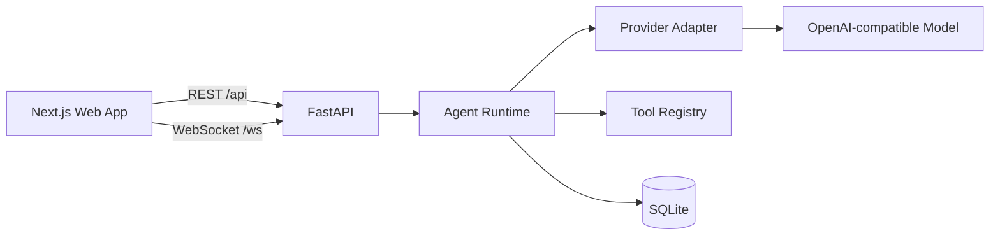

<p align="center">
  
</p>

<p align="center">
  A web-first AI tutoring platform built around a streaming agent loop.
</p>

<p align="center">
  
  
  
  
  
</p>

TeachX is an independent, web-first reimplementation inspired by
[DeepTutor](https://github.com/HKUDS/DeepTutor). It keeps the useful core of an
AI learning product: a streaming agent loop, model tool calling, reusable
tutoring capabilities, durable conversations, and a polished Next.js interface.

The project is designed to be understandable, deployable, and extensible rather
than a thin wrapper around a single model API.

## Current status

P0 is complete and verified end to end.

| Area | Status |
| --- | --- |
| Next.js web application | Working, 43 routes build successfully |
| FastAPI backend | Working |
| WebSocket turn protocol | Working |
| SQLite session persistence | Working |
| Agent loop | Working |
| Calculator tool calling | Working |
| Mock model provider | Working |
| OpenAI-compatible provider | Implemented, pending live provider integration tests |

The next milestone adds real token streaming, richer tool traces, automatic
session titles, and capability-specific prompts.

## Why TeachX

- **Agent-native:** Model turns can call tools, consume results, and continue
  until an answer is ready.
- **Web-first:** The product is designed around the browser instead of treating
  the web interface as an afterthought.
- **Provider-agnostic:** The runtime talks to a small provider interface, so
  hosted and local OpenAI-compatible models can be swapped without rewriting the
  agent loop.
- **Durable:** Sessions, messages, and turn events are persisted and replayable.
- **Extensible by design:** Tools and capabilities are explicit seams rather
  than hard-coded branches inside the chat route.

## Architecture



The first vertical slice intentionally keeps the system small:

```text
Next.js UI
  -> unified turn protocol
  -> AgentRuntime
  -> provider adapter
  -> tool registry
  -> session repository
```

## Quick start

### Prerequisites

- Python 3.12+
- Node.js 22+
- npm 10+
- [uv](https://docs.astral.sh/uv/)

No API key is required for the default mock provider.

### 1. Start the backend

```bash
cd backend
uv sync
uv run uvicorn teachx.main:app --app-dir src --reload --port 8010
```

### 2. Start the frontend

In a second terminal:

```bash
cd frontend
cp .env.example .env.local
npm ci
npm run dev
```

Open [http://localhost:3000](http://localhost:3000).

You can immediately test the complete path with:

```text
计算 12 * 8
```

The message travels through the browser, Next.js proxy, FastAPI WebSocket
protocol, agent runtime, calculator tool, and SQLite persistence.

## Use a real model

TeachX currently supports OpenAI and compatible Chat Completions APIs.

```bash
export TEACHX_LLM_PROVIDER=openai
export TEACHX_MODEL=gpt-4.1-mini
export OPENAI_API_KEY=your-api-key
export OPENAI_BASE_URL=https://api.openai.com/v1
```

Restart the backend after changing provider settings.

## What works today

- Streaming turn events over WebSocket
- Chat sessions with persisted history
- Basic multi-turn context
- Calculator tool calling
- Capability catalog: `chat`, `deep_solve`, and `deep_question`
- Mock mode for deterministic local development
- OpenAI-compatible provider adapter
- Frontend compatibility endpoints for optional DeepTutor surfaces

## Project structure

```text
TeachX/
├── backend/                 FastAPI service and agent runtime
│   ├── src/teachx/
│   │   ├── api/             HTTP and WebSocket adapters
│   │   ├── providers/       Mock and OpenAI-compatible adapters
│   │   ├── runtime/         Agent loop and tools
│   │   └── storage/         SQLite persistence
│   └── tests/
├── frontend/                Reused Apache-2.0 Next.js interface
├── docs/
│   ├── architecture.md
│   ├── readme-guide.md      README maintenance standard
│   └── roadmap.md
├── scripts/
│   ├── dev.sh               Start frontend and backend
│   └── check.sh             Run project checks
└── third_party/
    └── DeepTutor-LICENSE
```

## Quality checks

```bash
./scripts/check.sh
```

The check runs:

- Ruff
- Backend tests
- Frontend TypeScript validation

The frontend production build is verified separately:

```bash
cd frontend
npm run build
```

## Roadmap

| Milestone | Scope | Status |
| --- | --- | --- |
| P0 | Runnable web/backend vertical slice | Complete |
| P1 | Real streaming models, tool traces, capability prompts | Next |
| P2 | Knowledge upload, retrieval, citations | Planned |
| P3 | Authentication, PostgreSQL, deployment | Planned |
| P4 | CI, screenshots, demo environment, portfolio documentation | Planned |

See [docs/roadmap.md](docs/roadmap.md) for details.

## Relationship to DeepTutor

TeachX is not an official DeepTutor repository. The frontend is reused under the
Apache-2.0 license, while the backend and runtime are being rewritten with a
smaller product boundary.

See [UPSTREAM.md](UPSTREAM.md) for provenance and attribution.

## License

Apache License 2.0. See [LICENSE](LICENSE). The full upstream Apache-2.0 text is also preserved at [third_party/DeepTutor-LICENSE](third_party/DeepTutor-LICENSE).
